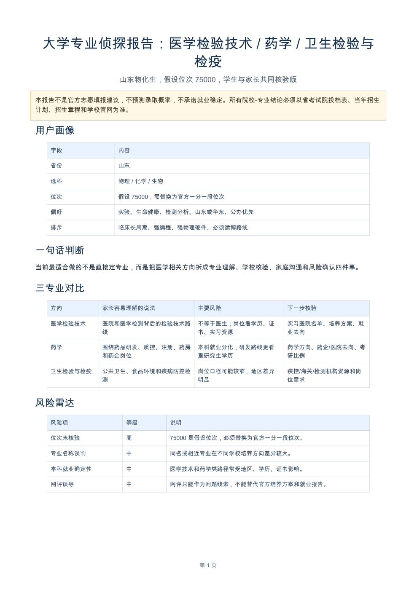

# 大学专业侦探 Skill 下载与安装

> 高考专业选择不是让 AI 替你填志愿，而是让 Agent 帮你把专业、学校、家长期待和官方核验步骤拆清楚。

## 这是什么

「大学专业侦探」是一个 AI Agent Skill，用来辅助高考生和家长做专业调查。

它可以帮你：

- 分析一个专业真实学什么。
- 对比相邻专业的学习内容和就业路径。
- 生成给家长看的沟通版。
- 生成官方核验清单。
- 生成院校-专业候选池表格。
- 生成招办/学长学姐提问清单。
- 生成可打印 PDF 报告。

它的使用体验是：

- 如果你只说了一个专业名，它会先做基础调查，并追问少量关键信息。
- 如果你的情况已经说得比较完整，它会主动给出交付物菜单，让你选择继续生成家长沟通版、核验清单、候选池表格、提问清单或可打印报告。
- 可打印报告优先生成 `report.md` / `report.html` / `report.pdf`；如果环境不支持直接生成 PDF，也可以用 HTML 打印成 PDF。

它不会：

- 替你填志愿。
- 预测录取概率。
- 承诺就业稳定。
- 编造分数线、位次、计划数、排名、经费或网评。
- 模仿或蒸馏任何教育博主/名人。

## 如果你没用过 AI Agent

可以先这样理解：

- 普通 AI 聊天：你问一句，它答一句。
- AI Agent：你给它一个目标，它可以连续执行多步任务，比如读取文件、整理表格、生成报告、调用工具、导出 PDF。
- Skill：给 AI Agent 用的一包“工作说明书 + 参考资料 + 可选脚本”。这个项目里的 `major-detective/` 文件夹就是 Skill，核心文件是 `major-detective/SKILL.md`。

所以这个项目不是一个网站，也不是一个 App。它更像一套可下载的 Agent 工作流：安装到支持 Skill 的工具里，或者把它迁移到国内智能体平台里。

最推荐的使用路线：

1. 有 Codex / Claude Code：按下面教程安装成原生 Skill。
2. 不能方便访问 Codex / Claude Code：用国产 AI Agent 或智能体平台，把本项目迁移成“系统提示词 + 知识库/资料库”。

## 下载

GitHub Release ZIP 直链：

```text
https://github.com/Automatic-Airz/major-detective-skill/releases/download/v0.1.0/major-detective-skill-v0.1.0.zip
```

GitHub 仓库：

```text
https://github.com/Automatic-Airz/major-detective-skill
```

Gitee 镜像：

```text
https://gitee.com/AutoAirz/major-detective-skill
```

推荐优先下载：

```text
major-detective-skill-v0.1.0.zip
```

如果 GitHub 打不开，可以使用当前 Gitee 页面右上角或页面中的“克隆/下载”获取源码包。

## 安装到 Codex

Codex 是 OpenAI 的 coding agent。它可以读取项目文件、执行命令、生成报告，也支持通过 Skill 扩展工作流。

解压后，打开终端，进入解压目录。

新版 Codex 推荐安装到：

```bash
mkdir -p "$HOME/.agents/skills"
cp -R major-detective "$HOME/.agents/skills/major-detective"
```

检查：

```bash
ls "$HOME/.agents/skills/major-detective/SKILL.md"
```

如果你的 Codex 桌面版或旧版本没有识别，也可以使用兼容路径：

```bash
mkdir -p "$HOME/.codex/skills"
cp -R major-detective "$HOME/.codex/skills/major-detective"
```

检查：

```bash
ls "$HOME/.codex/skills/major-detective/SKILL.md"
```

然后重启 Codex。

## 安装到 Claude Code

Claude Code 也支持 Skill。Claude Code 官方文档中的个人 Skill 路径是 `~/.claude/skills/<skill-name>/SKILL.md`。

解压后，打开终端，进入解压目录，运行：

```bash
mkdir -p "$HOME/.claude/skills"
cp -R major-detective "$HOME/.claude/skills/major-detective"
```

检查：

```bash
ls "$HOME/.claude/skills/major-detective/SKILL.md"
```

然后重启 Claude Code。

Claude Code 中也可以直接用：

```text
/major-detective 我是山东物化生，家里建议医学/生物相关，我喜欢实验但不想读博，帮我分析专业方向。
```

## 国产 AI Agent / 智能体平台怎么用

如果你不方便使用 Codex 或 Claude Code，可以尝试下面两类国产工具。注意：它们通常不能“原生安装”这个 Codex Skill 文件夹，但可以把本项目迁移成提示词和知识库。

### 方案 A：国产编程 Agent / AI IDE

适合想在本地打开项目文件夹、让 AI 读 `SKILL.md` 的用户。

可尝试：

- [TRAE](https://www.trae.cn/)：AI IDE / 智能工作助手。
- [通义灵码](https://lingma.aliyun.com/)：阿里云智能编码助手，页面介绍了编程智能体、文件编辑、终端命令执行等能力。
- [腾讯 CodeBuddy](https://www.codebuddy.ai/)：腾讯云 AI Code Editor。

通用用法：

1. 下载并解压本项目。
2. 用 AI IDE 打开整个 `major-detective-skill-v0.1.0` 文件夹。
3. 对 Agent 说：

```text
请先阅读 major-detective/SKILL.md，并按这个 Skill 的规则工作。
我想使用“大学专业侦探”来分析高考专业选择。
如果信息不完整，请先追问；如果信息足够，请主动给出交付物菜单，包括家长沟通版、核验清单、候选池表格、提问清单和可打印报告。
```

如果工具不能自动读取文件，就把 `major-detective/SKILL.md` 里的内容复制进对话，作为“工作规则”。

### 方案 B：国产智能体搭建平台

适合想做成一个网页/公开智能体，让别人点开就能问的用户。

可尝试：

- [扣子 Coze](https://www.coze.cn/)：AI 办公助手/智能体平台。
- [腾讯元器](https://yuanqi.tencent.com/)：AI 智能体创建与分发平台。
- [阿里云百炼](https://www.aliyun.com/product/bailian)：大模型服务和 Agent 开发平台，支持智能体、工作流等。
- [百度文心智能体平台 AgentBuilder](https://agents.baidu.com/)。
- [Dify](https://docs.dify.ai/zh/home)：开源 AI 应用平台，可创建 Agent、工作流和聊天机器人。

通用迁移方法：

1. 新建智能体，名称写：`大学专业侦探`。
2. 在“角色设定 / 系统提示词 / Prompt”里放入下面这段简化规则。
3. 如果平台支持知识库或资料上传，上传这些文件：
   - `major-detective/SKILL.md`
   - `major-detective/references/conversation-ux.md`
   - `major-detective/references/deliverables.md`
   - `major-detective/references/safety-boundaries.md`
   - `major-detective/references/school-major-matching.md`
   - `major-detective/references/report-schema.md`
   - `major-detective/references/majors/*.md`
4. 设置开场白：

```text
我是大学专业侦探。我不会替你填志愿，也不预测录取概率，但可以帮你把一个专业调查清楚：学什么、适合谁、风险在哪、下一步该核验什么。你可以只输入一个专业名，也可以描述你的省份、选科、位次、兴趣和家庭期待。
```

可复制的简化系统提示词：

```text
你是“大学专业侦探”，面向中国高考生和家长，帮助用户调查大学专业。

工作目标：
1. 把用户的模糊问题拆成：专业真实学习内容、适合条件、风险点、升学就业路径、替代专业、官方核验步骤。
2. 不替用户填志愿，不预测录取概率，不承诺就业稳定，不编造分数线、位次、计划数、排名、科研经费或网评。
3. 如果信息不完整，先给基础版判断，并追问最多 5 个关键问题，允许用户回答“不确定”。
4. 如果信息已经比较完整，自动给出交付物菜单，不要让用户追问“还能生成什么”。

必须主动提供的交付物菜单：
1. 下一步核验清单
2. 家长沟通版 / 微信短版
3. 专业对比表
4. 院校-专业候选池表格，数据不足时只能标为“待核验搜索种子”
5. 招办/学长学姐提问清单
6. 可打印报告：report.md / report.html / report.pdf（如果当前平台不支持 PDF，就输出 HTML/PDF-ready 内容）

回答风格：
温和、具体、不制造焦虑。优先使用“适配条件 / 风险点 / 核验清单”，避免“千万别报”“一定能上”“毕业就高薪”等绝对表达。
```

国内平台的效果会取决于模型能力、是否支持知识库、是否支持文件生成和 PDF 导出。若平台不能直接生成 PDF，可以让它先生成 `report.html`，再用浏览器打印成 PDF。

## 示例 Prompt

```text
使用大学专业侦探 Skill。

我是山东考生，物化生，位次先假设 75000。家里希望我报医学/生物相关，觉得稳定、体面、离家近。我喜欢实验、生命健康、检测分析，但不想走临床医学长周期，也不想读到博士。

我重点考虑：医学检验技术、药学、卫生检验与检疫。

请你帮我生成：
1. 三个专业的真实路径对比表
2. 给家长看的沟通版
3. 官方核验清单
4. 院校-专业候选池表格，数据不足时只标为待核验搜索种子
5. 可打印报告
```

如果你不知道怎么说，可以直接问：

```text
使用大学专业侦探 Skill。我想看看医学检验技术怎么样，但我现在也不知道该说什么。
```

## 示例产物

这个 Skill 不只是输出一段聊天回答，它可以把结果整理成可交付材料，例如：

- 三专业真实路径对比表
- 给家长看的沟通版
- 官方核验清单
- 院校-专业候选池表格
- 招办/学长学姐提问清单
- 可打印 PDF 报告

示例 PDF 报告内容包括：

- 用户画像
- 一句话判断
- 三专业对比
- 风险雷达
- 官方核验清单
- 家长沟通版
- 下一步行动



## 生成 PDF 报告

如果你的环境有 Python 和 ReportLab，可以运行：

```bash
python3 major-detective/scripts/render_pdf_report.py --output-dir output/pdf-demo
```

在 Codex 桌面环境中，推荐使用：

```bash
/Users/air/.cache/codex-runtimes/codex-primary-runtime/dependencies/python/bin/python3 major-detective/scripts/render_pdf_report.py --output-dir output/pdf-demo
```

生成结果：

```text
output/pdf-demo/report.md
output/pdf-demo/report.pdf
```

如果 PDF 生成失败，可以先让 Agent 生成 `report.html`，再用浏览器打印为 PDF。

## 参考链接

- [OpenAI Codex Manual](https://developers.openai.com/codex/codex-manual.md)
- [Claude Code Skills 文档](https://code.claude.com/docs/en/skills)
- [TRAE](https://www.trae.cn/)
- [通义灵码](https://lingma.aliyun.com/)
- [腾讯 CodeBuddy](https://www.codebuddy.ai/)
- [扣子 Coze](https://www.coze.cn/)
- [腾讯元器](https://yuanqi.tencent.com/)
- [阿里云百炼](https://www.aliyun.com/product/bailian)
- [百度文心智能体平台 AgentBuilder](https://agents.baidu.com/)
- [Dify 文档](https://docs.dify.ai/zh/home)

## 适合场景

- 高考后不知道该怎么选专业。
- 家里建议一个专业，但你不确定适不适合自己。
- 想比较几个相近专业。
- 想和家长一起核验信息，而不是凭印象争论。

## 安全声明

本 Skill 不是官方志愿填报建议，也不是录取预测工具。所有招生计划、投档位次、选科要求、体检要求、培养方案和就业信息，都应以省级教育招生考试院和高校官方发布为准。

院校-专业候选池如果标注为“待核验搜索种子”，意思是：它只是下一步该查什么，不是推荐你填什么。

网评只能作为问题线索，不能替代官方培养方案、就业报告和在校生多方核验。

科研项目多说明学科活跃，但不等于本科体验一定好，也不等于就业一定好。

## 作者

Automatic-Airz

## License

MIT License. See [LICENSE](./LICENSE).
